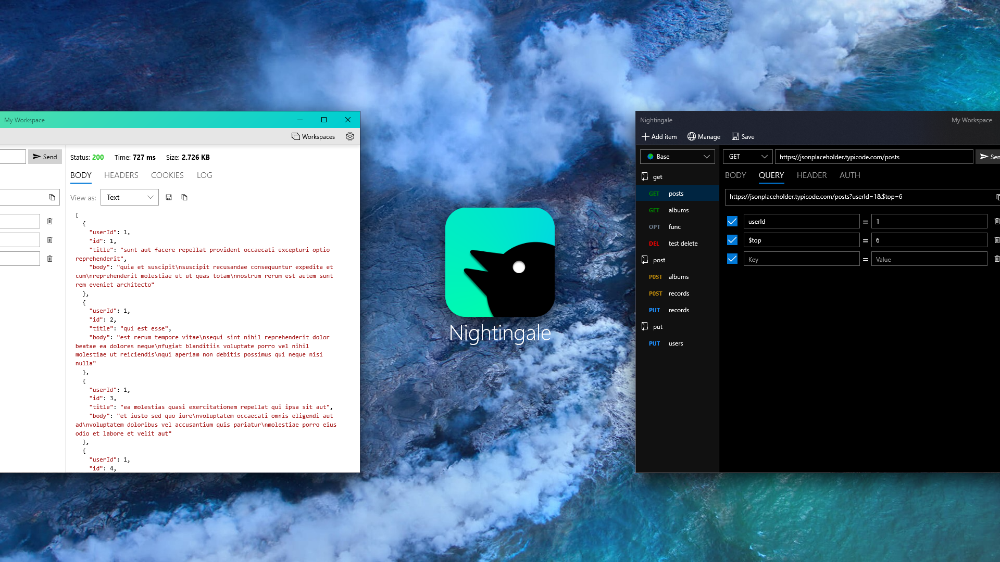

# Nightingale REST Client

Welcome to the official repo for Nightingale REST Client.

Download Nightingale here: https://www.microsoft.com/en-us/p/nightingale-rest-api-client/9n2t6f9f5zdn

### Source code

Starting on January 19, 2024, Nightingale became open source. As developers browse the code, they will see that the code is messy, disorganized, and poorly structured. This is because development of Nightingale started nearly a decade prior as a hobby project. Not only that, the creator -- Daniel Paulino -- only had a couple years of C# experience under his belt. This is why the source code you see today may not be as professional as you might prefer. So why open source the code today? A tool like Nightingale is perfectly situated to be supported by the open source community. A tool for developers, built by developers. Open sourcing the app has always been part of the plan, the lack of experience in the early days held it back. Now, I'm happy to release the source code.

### What's next? 

- First, a lot of refactoring will be needed to bring Nightingale up to speed in the modern world. Migrating to a better MVVM system. Migrating to the latest version of C#. And restructuring the repo to make feature development easier and faster.
- In parallel, I welcome bug fixes and minor changes from the community.
- Shortly after, I will start work on Nightingale v5.

### What will change for users now that it's open source?

- Nothing. The app will remain on the Microsoft Store to download for free.

## Build instructions

1. Retrieve an evaluation copy of Actipro's control library from here: https://www.actiprosoftware.com/download/controls/universal.
2. After filling out the form, downloading their package, and installing their SDK, you will need to update the SDK reference in the Nightingale project in Visual Studio.
4. Install any other missing components that Visual Studio tells you that you're missing.
5. Set `Package` as the default startup app. And change the debug architecture to x64. Then press F5 to start building and debugging the app.
